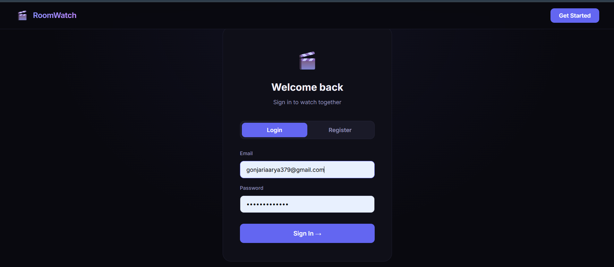
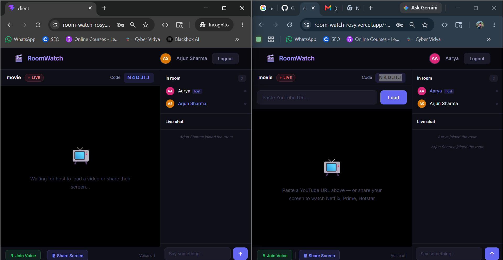
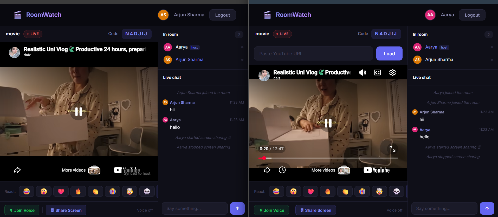
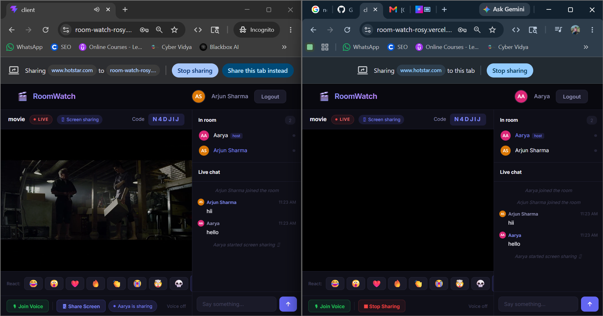

# RoomWatch 🎬

Real-time synchronized video streaming platform built using Node.js, Socket.IO, and MongoDB.

---

# 🚀 Features

- Real-time synchronized video playback
- Frame-perfect latency compensation
- Multi-user session rooms
- Role-based host controls
- Timestamp-based reaction overlays
- Low-latency WebSocket communication

---

# 🛠️ Tech Stack

## Frontend
- HTML
- CSS
- JavaScript

## Backend
- Node.js
- Express.js

## Database
- MongoDB

## Real-Time Communication
- Socket.IO
- WebSockets

---

# ⚡ Architecture Highlights

- Event-driven architecture
- WebSocket-based real-time communication
- Host-authoritative synchronization model
- MongoDB timestamp indexing for reaction mapping

---

# 📦 Installation

```bash
git clone https://github.com/GAARYA26/RoomWatch.git
cd RoomWatch
npm install
npm start
```

---
---

# 📸 Screenshots

## Home Page


## Watch Room


## Synchronized Playback


## Reactions & Controls


# 🔥 Future Improvements

- Video chat integration
- Authentication system
- Scalable distributed sessions
- AI-powered recommendations

---

# 👨‍💻 Author

Aarya Gonjari
